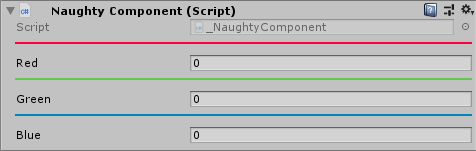

HorizontalLine
==============
Similar to Unity's ``Space`` attribute, but draws a horizontal line instead of an empty space.
You can control the hight (thickness) and color of the line::

    public class NaughtyComponent : MonoBehaviour
    {
        [HorizontalLine(color: EColor.Red)]
        public int red;

        [HorizontalLine(color: EColor.Green)]
        public int green;

        [HorizontalLine(color: EColor.Blue)]
        public int blue;
    }

