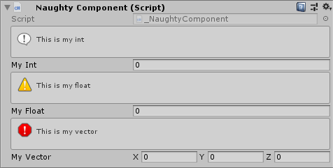

InfoBox
=======
Used to provide additional information::

    public class NaughtyComponent : MonoBehaviour
    {
        [InfoBox("This is my int", EInfoBoxType.Normal)]
        public int myInt;

        [InfoBox("This is my float", EInfoBoxType.Warning)]
        public float myFloat;

        [InfoBox("This is my vector", EInfoBoxType.Error)]
        public Vector3 myVector;
    }

