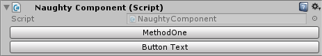

.. _label-button:

Button
======
A method can be marked as a button. A button appears in the inspector and executes the method if clicked.
Works both with instance and static methods.

.. warning::
    Doesn't work on methods that are nested inside serialized structs or classes.

::

    public class NaughtyComponent : MonoBehaviour
    {
        [Button]
        private void MethodOne(int parameter = 0) { } // Works with default parameters

        [Button("Button Text")] // Specify button text
        private void MethodTwo() { }

        [Button(enabledMode: EButtonEnableMode.Editor)]
        private void EnabledInEditorOnly() { }

        [Button(enabledMode: EButtonEnableMode.Playmode)]
        private void EnabledInPlaymodeOnly() { }

        [Button] // When pressed and the target object is a MonoBehaviour, it will start the coroutine
        private IEnumerator SomeCoroutine() { }
    }

