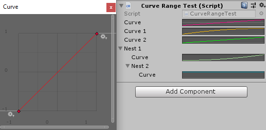

CurveRange
==========
Can limit the ``x`` and ``y`` values of an animation curve, and/or change the color of the curve in the inspector::

    public class NaughtyComponent : MonoBehaviour
    {
        [CurveRange(-1, -1, 1, 1)] // min.x = -1, min.y = -1, max.x = 1, max.y = 1
        public AnimationCurve curve;
        
        [CurveRange(EColor.Orange)]
        public AnimationCurve curve1;
        
        [CurveRange(0, 0, 5, 5, EColor.Red)]
        public AnimationCurve curve2;
    }

