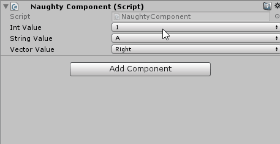

Dropdown
========
Provides an interface for dropdown value selection.
The values of the dropdown can be provided by a ``field``, ``property`` or ``function``.

.. warning::
    When nested inside a **struct** the value of the dropdown doesn't update.
    This is because the value of the parent struct is updated via reflection.
    In order for the value to be updated the struct needs to be **boxed** and then **unboxed**.
    The sctruct is already passed as an object (boxed) to the dropdown drawer, but unfortunately in order
    to unbox it I need to know the compile-time type of the struct, and I don't.
    Nesting inside a **class** works as expected.

::

    public class NaughtyComponent : MonoBehaviour
    {
        [Dropdown("intValues")]
        public int intValue;

        [Dropdown("StringValues")]
        public string stringValue;

        [Dropdown("GetVectorValues")]
        public Vector3 vectorValue;

        private int[] intValues = new int[] { 1, 2, 3, 4, 5 };

        private List<string> StringValues { get { return new List<string>() { "A", "B", "C", "D", "E" }; } }

        private DropdownList<Vector3> GetVectorValues()
        {
            return new DropdownList<Vector3>()
            {
                { "Right",   Vector3.right },
                { "Left",    Vector3.left },
                { "Up",      Vector3.up },
                { "Down",    Vector3.down },
                { "Forward", Vector3.forward },
                { "Back",    Vector3.back }
            };
        }
    }

