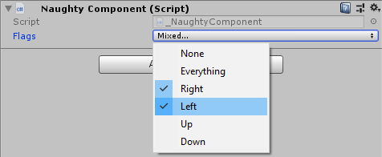

EnumFlags
=========
Provides a dropdown interface for setting enum flags::

    public enum Direction
    {
        None = 0,
        Right = 1 << 0,
        Left = 1 << 1,
        Up = 1 << 2,
        Down = 1 << 3
    }

    public class NaughtyComponent : MonoBehaviour
    {
        [EnumFlags]
        public Direction flags;
    }

