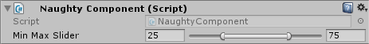

.. _label-min-max-slider:

MinMaxSlider
============
A double slider.
The **min value** is saved to the ``x`` property, and the **max value** is saved to the ``y`` property of a ``Vector2`` or a ``Vector2Int`` field::

    public class NaughtyComponent : MonoBehaviour
    {
        [MinMaxSlider(0.0f, 100.0f)]
        public Vector2 minMaxSlider;
    }

