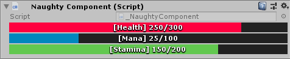

ProgressBar
===========
Draws a progress bar. Can be applied to an ``int`` or a ``float``::

    public class NaughtyComponent : MonoBehaviour
    {
        [ProgressBar("Health", 300, EColor.Red)]
        public int health = 250;

        [ProgressBar("Mana", 100, EColor.Blue)]
        public int mana = 25;

        [ProgressBar("Stamina", "maxStamina", EColor.Green)] // Dynamic max value constructor
        public int stamina = 150;

        public int maxStamina = 200;
    }

