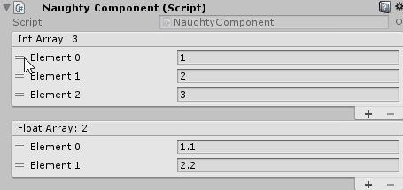

.. _label-reorderable-list:

ReorderableList
===============
Provides array type fields with an interface for easy reordering of elements.
As of **Unity 2020.2.x** all lists are reorderable by default, so you no longer have to use this attribute.

.. warning::
    Doesn't work on lists that are nested inside serialized structs of classes.

::

    public class NaughtyComponent : MonoBehaviour
    {
        [ReorderableList]
        public int[] intArray;

        [ReorderableList]
        public List<float> floatArray;
    }

