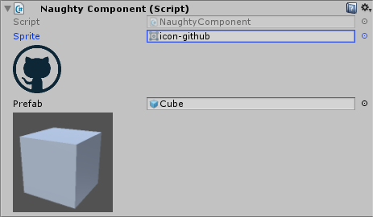

ShowAssetPreview
================
Shows the texture preview of a given asset (Sprite, Prefab...)::

    public class NaughtyComponent : MonoBehaviour
    {
        [ShowAssetPreview]
        public Sprite sprite;

        [ShowAssetPreview(128, 128)]
        public GameObject prefab;
    }

