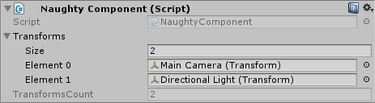

.. _label-show-native-property:

ShowNativeProperty
==================
Shows native C# properties in the inspector.
It supports only certain types ``bool``, ``short``, ``ushort``, ``int``, ``uint``, ``long``, ``ulong``, ``float``, ``double``, ``string``,
``Vector2``, ``Vector3``, ``Vector4``, ``Vector2Int``, ``Vector3Int``, ``Color``, ``Bounds``, ``Rect``, ``RectInt``, ``UnityEngine.Object``.

.. warning::
    Doesn't work on properties that are nested inside serialized structs of classes.

::

    public class NaughtyComponent : MonoBehaviour
    {
        public List<Transform> transforms;

        [ShowNativeProperty]
        public int TransformsCount => transforms.Count;
    }

