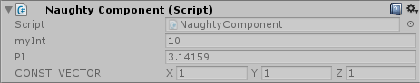

.. _label-show-non-serialized-field:

ShowNonSerializedField
======================
Shows non-serialized fields in the inspector.
Keep in mind that if you change a non-static non-serialized field in the code - the value in the inspector will be updated after you press **Play** in the editor.
There is no such issue with static non-serialized fields because their values are updated at compile-time.
It supports only certain types ``bool``, ``short``, ``ushort``, ``int``, ``uint``, ``long``, ``ulong``, ``float``, ``double``, ``string``,
``Vector2``, ``Vector3``, ``Vector4``, ``Vector2Int``, ``Vector3Int``, ``Color``, ``Bounds``, ``Rect``, ``RectInt``, ``UnityEngine.Object``.

.. warning::
    Doesn't work on non-serialized fields that are nested inside serialized structs of classes.

::

    public class NaughtyComponent : MonoBehaviour
    {
        [ShowNonSerializedField]
        private int myInt = 10;

        [ShowNonSerializedField]
        private const float PI = 3.14159f;

        [ShowNonSerializedField]
        private static readonly Vector3 CONST_VECTOR = Vector3.one;
    }

