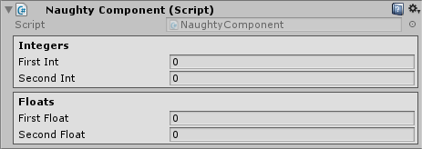

BoxGroup
========
Can be used to group serialized fields.

.. warning::
    Doesn't work on serialized fields that are nested inside serialized structs of classes.

::

    public class NaughtyComponent : MonoBehaviour
    {
        [BoxGroup("Integers")]
        public int firstInt;
        [BoxGroup("Integers")]
        public int secondInt;

        [BoxGroup("Floats")]
        public float firstFloat;
        [BoxGroup("Floats")]
        public float secondFloat;
    }

