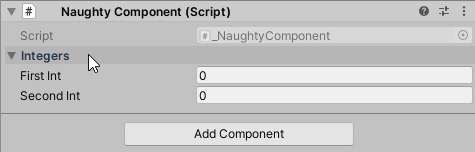

Foldout
=======
Makes a foldout group.

.. warning::
    Doesn't work on serialized fields that are nested inside serialized structs of classes.

::

    public class NaughtyComponent : MonoBehaviour
    {
        [Foldout("Integers")]
        public int firstInt;
        [Foldout("Integers")]
        public int secondInt;
    }

