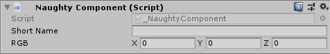

Label
=====
Override default field label.

.. note::
    If you want to use it on fields that are nested inside serialized structs or classes
    you need to use the :ref:`label-allow-nesting` attribute.

::

    public class NaughtyComponent : MonoBehaviour
    {
        [Label("Short Name")]
        public string veryVeryLongName;

        [Label("RGB")]
        public Vector3 vectorXYZ;
    }

