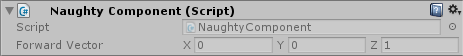

ReadOnly
========
Make a serialized field readonly

.. note::
    If you want to use it on fields that are nested inside serialized structs or classes
    you need to use the :ref:`label-allow-nesting` attribute.

::

    public class NaughtyComponent : MonoBehaviour
    {
        [ReadOnly]
        public Vector3 forwardVector = Vector3.forward;
    }

