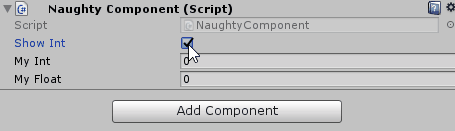

ShowIf / HideIf
===============
Can be used to show/hide serialized fields or buttons based on some condition.
The condition can be a ``field``, ``property`` or ``function``.

.. note::
    If you want to use it on fields that are nested inside serialized structs or classes
    you need to use the :ref:`label-allow-nesting` attribute.

::

    public class NaughtyComponent : MonoBehaviour
    {
        public bool showInt;

        [ShowIf("showInt")]
        public int myInt;

        [ShowIf("AlwaysShow")]
        public float myFloat;

        [ShowIf("NeverShow")]
        public Vector3 myVector;

        public bool AlwaysShow() { return true; }

        public bool NeverShow => false;
    }

You can have more than one condition::

    public class NaughtyComponent : MonoBehaviour
    {
        public bool flag0;
        public bool flag1;

        [ShowIf(EConditionOperator.And, "flag0", "flag1")]
        public int showIfAll;

        [ShowIf(EConditionOperator.Or, "flag0", "flag1")]
        public int showIfAny;
    }

An enum value can also be used as a condition::

    public class NaughtyComponent : MonoBehaviour
    {
        public EMyEnum enumFlag;

        [ShowIf("enumFlag", EMyEnum.Case0)]
        public int enableIfEnum; // Will be shown only if enumFlag == EMyEnum.Case0
    }

    public enum EMyEnum
    {
        Case0,
        Case1,
        Case2
    }
