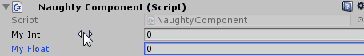

MinValue / MaxValue
===================
Can be used to limit the range of variables.
Can be applied to ``int``, ``float``, ``Vector2``, ``Vector3``, ``Vector4``, ``Vector2Int``, ``Vector3Int``.

.. note::
    If you want to use it on fields that are nested inside serialized structs or classes
    you need to use the :ref:`label-allow-nesting` attribute.

::

    public class NaughtyComponent : MonoBehaviour
    {
        [MinValue(0), MaxValue(10)]
        public int myInt;

        [MinValue(0.0f)]
        public float myFloat;
    }

