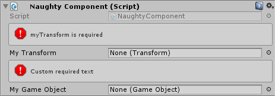

Required
========
Used to remind the user that a given reference type field is required.

.. note::
    If you want to use it on fields that are nested inside serialized structs or classes
    you need to use the :ref:`label-allow-nesting` attribute.

::

    public class NaughtyComponent : MonoBehaviour
    {
        [Required]
        public Transform myTransform;

        [Required("Custom required text")]
        public GameObject myGameObject;
    }

