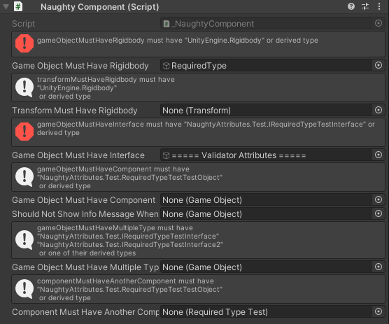

RequiredType
============
Used on game objects or components.
When used on a game object, it checks if the game object has a component of the required type.
When used on a component, it checks if the game object it is attached to has a component of the required type.

.. note::
    If you want to use it on fields that are nested inside serialized structs or classes
    you need to use the :ref:`label-allow-nesting` attribute.

::

    public class NaughtyComponent : MonoBehaviour
    {
        [RequiredType(typeof(Rigidbody))]
        public GameObject gameObjectMustHaveRigidbody;

        [RequiredType(typeof(Rigidbody))]
        public Transform transformMustHaveRigidbody;

        [RequiredType(typeof(IRequiredTypeTestInterface))]
        public GameObject gameObjectMustHaveInterface;

        [RequiredType(typeof(RequiredTypeTestTestObject))]
        public GameObject gameObjectMustHaveComponent;

        [RequiredType(showInfoMessageWhenEmpty: false, typeof(IRequiredTypeTestInterface))]
        public GameObject shouldNotShowInfoMessageWhenEmpty;

        [RequiredType(typeof(IRequiredTypeTestInterface), typeof(IRequiredTypeTestInterface2))]
        public GameObject gameObjectMustHaveMultipleType;

        [RequiredType(typeof(RequiredTypeTestTestObject))]
        public RequiredTypeTest componentMustHaveAnotherComponent;
    }

