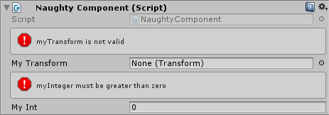

ValidateInput
=============
The most powerful ValidatorAttribute.

.. note::
    If you want to use it on fields that are nested inside serialized structs or classes
    you need to use the :ref:`label-allow-nesting` attribute.

::

    public class NaughtyComponent : MonoBehaviour
    {
        [ValidateInput("IsNotNull")]
        public Transform myTransform;

        [ValidateInput("IsGreaterThanZero", "myInteger must be greater than zero")]
        public int myInt;

        private bool IsNotNull(Transform tr)
        {
            return tr != null;
        }

        private bool IsGreaterThanZero(int value)
        {
            return value > 0;
        }
    }

